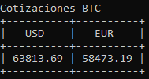
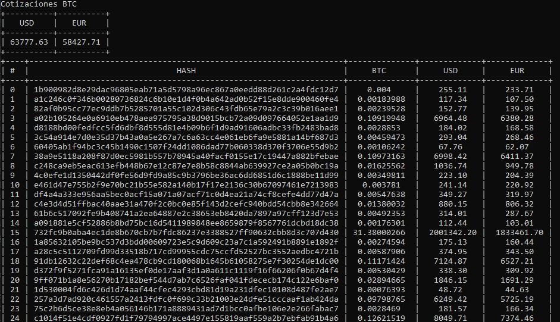
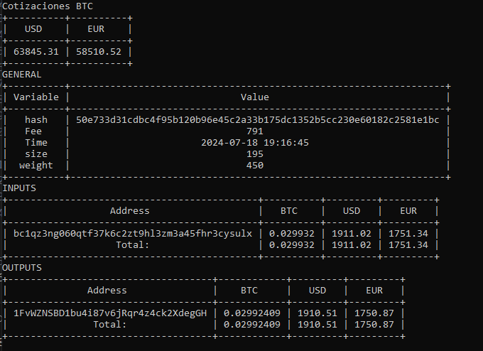
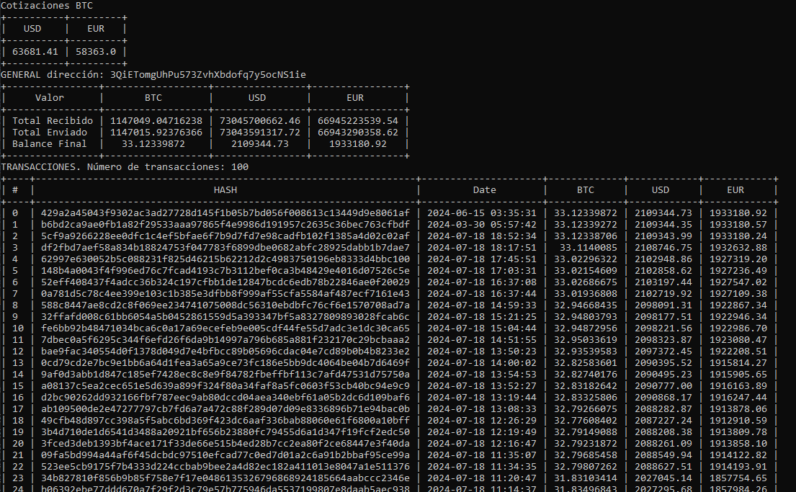

# Utilidades BlockChain

Es un conjunto de scripts de Python destinados a inspeccionar transacciones en el Block Chain. Se hace uso de las APIs documentadas en [blockchain.com](https://www.blockchain.com/es/explorer/api/blockchain_api) 

## btcRating

* Devuelve la cotización del BitCoin en este instante.
* Se invoca en el comando: _python btcRating.py_

## blkChain

* Devuelve una tabla con las 100 últimas transacciones no confirmadas. se muestra el Hash de la transacción y la cantidad
* Se invoca con el comando: _python blkChain.py_ 
* Tambien se muestra una tabla con la cotización del BitCoin

* El script pregunta si se quiere analizar una transacción en detalle. Si se contesta 's', el script te pide el número de la tranasacción correspondiente e invoca automáticamente al script singleTx.py

## singleTx

* Este script devuelve la información más detallada sobre una transacción proporcionando el Hash de la misma. Se muestra la información general y la información de las entradas y salidas con las direcciones (wallets) de origen y de destino. El script emieza tambien con la información de la cotización del BitCoin.
* Se invoca con el comando: _python singleTx.py hash_, donde se ha de especificar el hash de la transacción.

## showAddr

* Este script devuelve una tabla con las transacciones realizadas sobre una dirección concreta. Se muestra primero las más recientes y la tabla acaba con las más antiguas. Si existienran más de 100 transacciones asocieadas a esta dirección se mostrarían solo las 100 transacciones más recientes. Como en los anteriores scripts, también se comienza con la cotización del BitCoin.
* Se invoca con el comando: _python showAddr.py address_, donde address es la dirección que se quiere inspeccionar.

